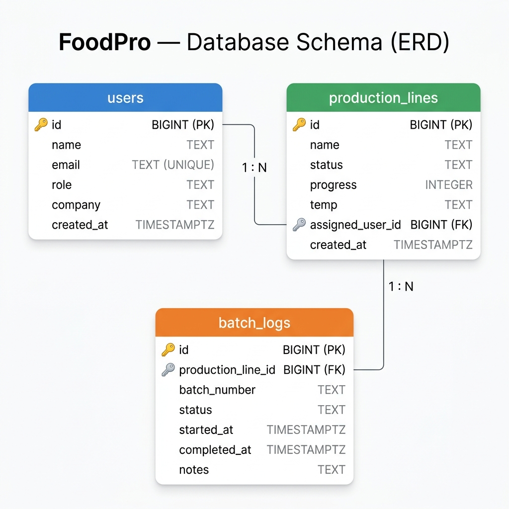

# FoodPro

An intelligent, real-time platform to automate, monitor, and optimize food production pipelines with cutting-edge analytics.

## Tech Stack
- **Framework**: Next.js 16 (App Router)
- **Library**: React 19
- **Database**: PostgreSQL (Supabase)
- **Styling**: Tailwind CSS v4
- **Icons**: Lucide React

---

## Database Schema & Data Model

We use **PostgreSQL (via Supabase)** to persist all application data. The schema comprises 3 core entities modeling users, production lines, and historical batch logs.

### Entity-Relationship Diagram (ERD)

### Entities & Field Definitions

#### 1. `users`
Represents the plant managers and conveyor belt operators running the facilities.
* **`id`** (`BIGINT`, Primary Key): Auto-incremented unique user identifier.
* **`name`** (`TEXT`, Not Null): Full name of the user.
* **`email`** (`TEXT`, Not Null, Unique): Unique email address used for logging in.
* **`role`** (`TEXT`, Not Null): User role (e.g., `'Plant Manager'`, `'Operator'`, `'Quality Analyst'`).
* **`company`** (`TEXT`): Company name.
* **`created_at`** (`TIMESTAMPTZ`): Timestamp when the user profile was registered.

#### 2. `production_lines`
Represents physical manufacturing pipelines and conveyers monitoring real-time metrics.
* **`id`** (`BIGINT`, Primary Key): Auto-incremented unique production line identifier.
* **`name`** (`TEXT`, Not Null): Line title (e.g., `'Line 1 — Dairy Processing'`).
* **`status`** (`TEXT`, Not Null): Operational status, constrained to `'Running'`, `'Paused'`, or `'Stopped'`.
* **`progress`** (`INTEGER`, Not Null): Progress percentage of the line's current batch, constrained between `0` and `100`.
* **`temp`** (`TEXT`, Not Null): Real-time zone temperature (e.g., `'4.2°C'`).
* **`assigned_user_id`** (`BIGINT`, Foreign Key): Links to `users.id`. Represents the manager/operator assigned to the line.
* **`created_at`** (`TIMESTAMPTZ`): Timestamp when the line was cataloged.

#### 3. `batch_logs`
Logs the history of manufacturing batches processed across various lines.
* **`id`** (`BIGINT`, Primary Key): Auto-incremented unique log identifier.
* **`production_line_id`** (`BIGINT`, Foreign Key, Not Null): Links to `production_lines.id` with `ON DELETE CASCADE`.
* **`batch_number`** (`TEXT`, Not Null): Custom batch tracking reference (e.g., `'BATCH-4720'`).
* **`status`** (`TEXT`, Not Null): Progress state, constrained to `'In Progress'`, `'Completed'`, or `'Failed'`.
* **`started_at`** (`TIMESTAMPTZ`): Start timestamp.
* **`completed_at`** (`TIMESTAMPTZ`): End timestamp.
* **`notes`** (`TEXT`): Log comments, error descriptions, or quality metrics.

### Relationships
* **User to Production Lines (`1 : N`)**: One user can oversee or be assigned to run multiple production lines. A production line belongs to at most one assigned user.
* **Production Line to Batch Logs (`1 : N`)**: One production line processes many batches over time. Each batch log belongs to exactly one production line.

---

## Setup & Running Locally

Detailed local setup, development guidelines, and deployment instructions are described in the [walkthrough.md](file:///Users/vineetchoudhary/.gemini/antigravity-ide/brain/9ba8732f-69af-409a-bee7-f0215f30d8a4/walkthrough.md) artifact.
